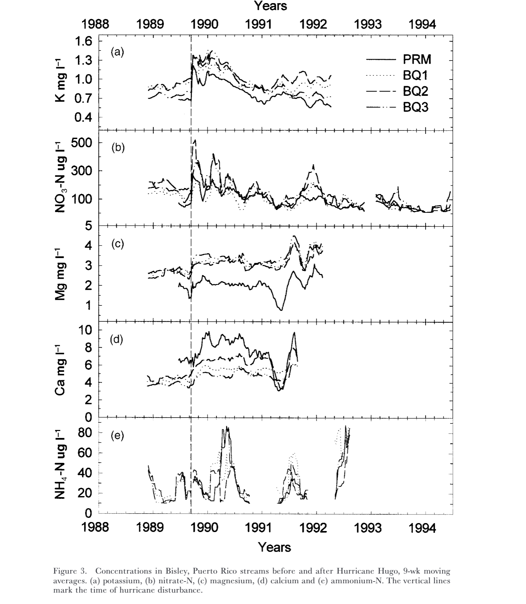

# Hurricane Hugo effect on stream nutrient concentrations in Bisley, Puerto Rico

## Repo Purpose

The purpose of the ndkb214final repository is to reproduce Figure 3 from Schaefer et al. (2000), which shows the moving-average trends in streamwater ion concentrations before and after Hurricane Hugo (1989). The analysis incorporates data from four sampling locations: BQ1, BQ2, BQ3, and Rio Mameyes. The ions examined in Figure 3 include (a) potassium (K), (b) nitrate-N (NO₃-N), (c) magnesium (Mg), (d) calcium (Ca), and (e) ammonium-N (NH₄-N). The repository contains the data processing, analysis, and visualization workflows required to recreate these figures and evaluate changes in nutrient dynamics associated with Hurricane Hugo.

## Description of Repo Contents

* **data folder**: 5 data sets of the different Sample_IDs (LUQ LTER MDLs (not needed), QuebradaCuenca1 (BQ1), QuebradaCuenca2 (BQ2), QuebradaCuenca3 (BQ3), and RioMameyesPuenteRoto (Rio_Mam)).
* **docs folder**: Contains the html file used for creating a webpage in GitHub Pages. The html file is the same as the quarto markdown file in the paper folder.
* **figure recreation**: Recreated figure 3.
* **output**: Binded_table is the combined Sample_ID data frames and binded_long is the reorganized table with the columns: window_start, Sample_ID, ions, and window_mean. This table is used to recreate figure 3. 
* **paper folder**: This folder contains a quarto markdown file that visualizes and breaksdown the cleaned data from 1_clean_data.R. It produces our recreation of figure 3 from Schaefer et al. (2000)
* **R folder**: This folder contains the code that creates the function moving_average() that allows us to clean the raw data and produce the moving_average of each of the ions. 
* **README_files**: ignore this folder, these files help my README run.
* **scratch folder**: Rough draft code to recreate figure 3.
* **1_clean_data.R**: R markdown file that is the cleaned up raw data that incorporates the moving_average() function that produced the bined_long table. 

## Data Access

* Data folder contents was downloaded from: McDowell, W. and International Institute of Tropical Forestry(IITF), USDA Forest Service.. 2024. Chemistry of stream water from the Luquillo Mountains ver 4923064. Environmental Data Initiative. https://doi.org/10.6073/pasta/f31349bebdc304f758718f4798d25458 (Accessed 2026-08-25)

* Data files downloaded:
** QuebradaCuenca1-Bisley.csv
** QuebradaCuenca2-Bisley.csv
** QuebradaCuenca3-Bisley.csv
** RioMameyesPuenteRoto.csv

## Authors and current contributors

Nina Berry: https://github.com/nberry18
Calvin Fu: https://github.com/cuvlin 
Elyse Owen: https://github.com/eowen19 

# References
McDowell, William H., and USDA Forest Service. International Institute Of Tropical Forestry (IITF). 2024. “Chemistry of Stream Water from the Luquillo Mountains.” Environmental Data Initiative. https://doi.org/10.6073/PASTA/F31349BEBDC304F758718F4798D25458.

Schaefer, Douglas. A., William H. McDowell, Fredrick N. Scatena, and Clyde E. Asbury. 2000. “Effects of Hurricane Disturbance on Stream Water Concentrations and Fluxes in Eight Tropical Forest Watersheds of the Luquillo Experimental Forest, Puerto Rico.” Journal of Tropical Ecology 16 (2): 189–207. https://doi.org/10.1017/s0266467400001358.